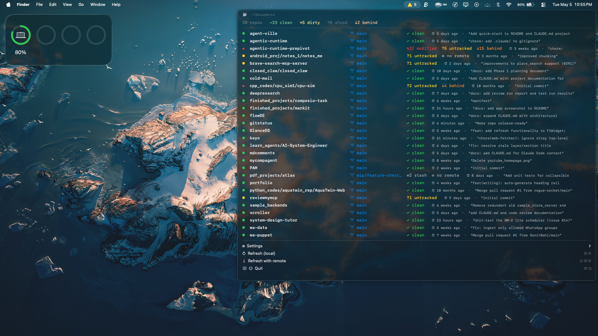

# GitStatusBar

A tiny native macOS menu bar app that scans folders for git repositories and
shows each repo's branch and working-tree state at a glance.

- Native AppKit (`NSStatusItem`) — no Dock icon, no background polling
- Idle CPU 0%, RSS in single-digit MB
- Manual refresh only (⌘R local, ⇧⌘R with `git fetch`)



## Requirements

- macOS 13 (Ventura) or later
- Xcode command-line tools (`xcode-select --install`) — provides Swift 5.9+
- `git` on `PATH`

## Install

```sh
git clone https://github.com/rogue-socket/gitstatus.git
cd gitstatus
./build-app.sh
mv GitStatusBar.app /Applications/
open /Applications/GitStatusBar.app
```

The app lives in the menu bar (look for the branch icon, top-right). There is
no Dock icon by design.

### First launch — Gatekeeper

Because the build is **ad-hoc signed** (no Apple Developer account), macOS
will refuse to open it on first launch with a "cannot be opened because the
developer cannot be verified" warning. Workaround:

1. Open Finder, go to `/Applications`.
2. Right-click `GitStatusBar.app` → **Open**.
3. Click **Open** in the dialog.

You only have to do this once. Alternatively:

```sh
xattr -dr com.apple.quarantine /Applications/GitStatusBar.app
```

### Launch at login

Open the menu bar dropdown → `Settings ▸ Launch at Login`. Or drag the app
into System Settings → General → Login Items.

## Use

Click the branch icon in the menu bar:

- **Header**: scan root + summary counts.
- **Per-repo line**: `name  ⎇ branch  · verdict`. Click → reveal in Finder.
  Hover → last commit message.
- **`Settings ▸`**
  - `Folders to scan`: each configured folder appears here. Hover to reveal a
    submenu with `Reveal in Finder` and `Remove`.
  - `Add folder…` opens a system picker (multi-select supported).
  - `Launch at Login` toggles auto-start.
- **`↻ Refresh (local)`** (⌘R) — rescan working trees only. Fast, no network.
- **`⇣ Refresh with remote`** (⇧⌘R) — runs `git fetch --quiet` per repo
  before computing ahead/behind counts. Slower, contacts remotes.
- **`Quit`** (⌘Q).

## Configuration

- Default scan root: `~/Documents` at depth 3.
- Roots are persisted in `UserDefaults` under key `scanRoots` (an array of
  paths; `~` is rewritten back to `$HOME` for portability).
- When more than one folder is configured, repo names are prefixed with the
  root's name to disambiguate.
- All settings live in the menu — there is no preferences window.

## Build from source

```sh
swift build -c release      # compile only
./build-app.sh              # compile + assemble GitStatusBar.app + ad-hoc sign
```

`build-app.sh` is the canonical packaging step. It also regenerates
`Resources/AppIcon.icns` from `Resources/make-icon.swift` if it's missing.

## Uninstall

```sh
rm -rf /Applications/GitStatusBar.app
defaults delete com.github.rogue-socket.gitstatusbar 2>/dev/null || true
```

## Architecture

Four files in `Sources/GitStatusBar/`:

- `main.swift` — `AppDelegate`, status item, menu, settings, refresh lifecycle
- `GitScanner.swift` — pure scan logic; bounded concurrency (8), per-call git
  timeouts (5 s; 15 s for `fetch`)
- `RepoStatus.swift` — value type + verdict computation
- `MenuStyle.swift` — colours, fonts, status glyphs

See `CLAUDE.md` for deeper notes.

## Contributing

Issues and PRs welcome. There are no tests; verification is manual:

```sh
./build-app.sh && open GitStatusBar.app
ps -o rss,pid,comm -p "$(pgrep GitStatusBar)"   # RSS should be single-digit MB
```

## License

MIT — see [LICENSE](LICENSE).
